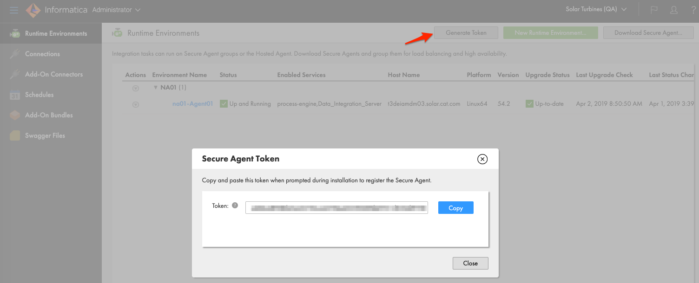

# Run Informatica Agent in Docker Container

<!-- MarkdownTOC -->

- [Run Informatica Agent in Docker Container](#run-informatica-agent-in-docker-container)
  - [Description](#description)
  - [1. Prepare Org for Agent installation](#1-prepare-org-for-agent-installation)
    - [1.1 Create User](#11-create-user)
  - [2. Build a Docker Image](#2-build-a-docker-image)
  - [3. Create and run a Container using your Docker Image](#3-create-and-run-a-container-using-your-docker-image)
    - [3.1 Ports Exposed by Image](#31-ports-exposed-by-image)
    - [3.2 Image Volumes](#32-image-volumes)
    - [. Connect and Initialize Agent](#-connect-and-initialize-agent)

<!-- /MarkdownTOC -->

## Description

This package contains example docker file and supporting scripts to run Informatica CLoud Secure Agent on a Docker Container.
Note that this is not an official or supported method how to run Informatica Secure Agent. It is useful though to  learning how to setup secure agent, create agent clusters or test integrations
Full containerization of Secure agent is non trivial as it requires custom configuration of agent if deem to use this method as your runtime

## 1. Prepare Org for Agent installation

### 1.1 Create User

1. Create IICS Native user account which will be used to connect secure agent and assign user to Admin Group
    Follow naming convention that includes company domain and environment such as `sa_login@acme.com.dev`
2. Login to informatica Cloud to activate the user and retrieve the Secure Agent Token on the Administration/Runtime Environments page
    

## 2. Build a Docker Image

1. Make sure you have docker installed, go to (https://docs.docker.com/engine/installation/)
2. Make sure you have a git client installed
3. Clone repository with contents of this project

    ```shell
    git clone git@github.com:jbrazda/ic-sagent-docker.git
    ```

4. Update the [Dockerfile](Dockerfile) if necessary (Location of the SA agent installer might be different for your Informatica CLoud org) You can override the default location by specifying `--build-arg <name>=<value>` in next step
5. Run command to build a docker Image

    ```shell
    docker build -t ic-secure-agent:1.0 .
    ```

    The Agent installation location will be dependent on a specific Informatica Pod where your org is provisioned
    To override the download file location use AGENT_URL argument. typical format for download url is
    `https://<pod>.<region>.informaticacloud.com/saas/download/linux64/installer/agent64_install_ng_ext.bin`

    ```shell
    docker build --build-arg AGENT_URL=https://na1.dm-us.informaticacloud.com/saas/download/linux64/installer/agent64_install_ng_ext.bin -t ic-secure-agent:1.0 .
    ```

## 3. Create and run a Container using your Docker Image

Execute following command `run -d -h <hostname> --name <agent_name> <image_name:image_tag>`

```shell
docker run -d -h agent1 --name ic-agent1 ic-secure-agent:1.0
```

If you want to make certain ports available on your host like ability to call Secure agent processes  or access oProcess engine Database from your host machine map the available exposed ports using th -p option of the docker run command

```shell
docker run -d -h agent1 --name ic-agent1 -p 7080:7080 -p 7443:7443 ic-secure-agent:1.0
```

or

```shell
docker run -d -h agent1 --name ic-agent1 \
    -p 7080:7080 \
    -p 7443:7443 \
    -p 5432:5432 \
    ic-secure-agent:1.0
```

### 3.1 Ports Exposed by Image

| Port | Description                |
|------|----------------------------|
| 7080 | Process Engine http port   |
| 7443 | Process Engine https port  |
| 5432 | Process Engine Postgres DB |

### 3.2 Image Volumes

Process engine uses several directories to write logs or store it's data or provide external Extension files or configurations. It is desired to make these directories available on host machine and persisted outside the Container in Docker Volume

Volumes are defined as follows

| Volume                                                   | Description                                                                                                 |
|----------------------------------------------------------|-------------------------------------------------------------------------------------------------------------|
| `/home/iics/infaagent/apps/process-engine/logs`          | Directory with Process Engine Logs                                                                          |
| `/home/iics/infaagent/apps/process-engine/data`          | Directory Containing Process Engine Database And Backups                                                    |
| `/home/iics/infaagent/apps/Data_Integration_Server/data` | Directory Containing Integration Service Data                                                               |
| `/home/iics/infaagent/apps/Data_Integration_Server/logs` | Directory Containing Integration Service Logs                                                               |
| `/home/iics/infaagent/apps/process-engine/ext`           | Process Engine Extensions, External Libraries, JDBC drivers. etc jars in this dir are added to PE classpath |
| `/home/iics/infaagent/apps/Data_Integration_Server/ext`  | Process Engine Extensions, External Libraries, JDBC drivers                                                 |

Stop the container using a `docker stop <container_name` i.e. docker stop

### . Connect and Initialize Agent

We need to configure the agent to connect it to your Informatica Cloud Org When you running agent for the first time, run following command in the host machine to connect to running agent

```shell
docker exec -it ic-agent1 bash
```

Then run following command to configure agent Prefer using the new method of using username/token instead of password

Using Token

```shell
./consoleAgentManager.sh configureToken '<username>' '<token>'
```

Using Password

```shell
./consoleAgentManager.sh configure '<username>' '<password>'
```

You can monitor agent logs running by

```shell
docker exec -it ic-agent1 less agentCore.log
```
